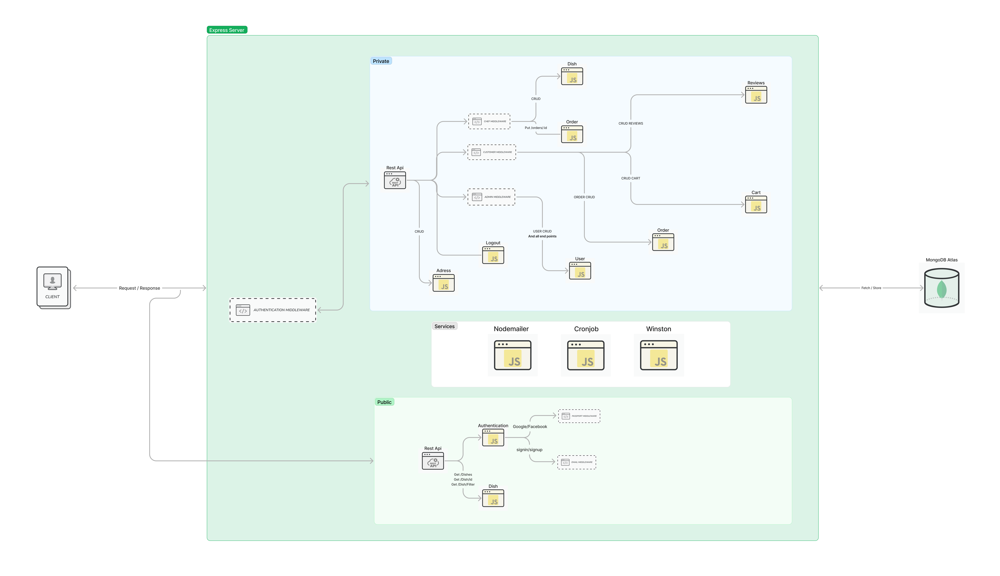
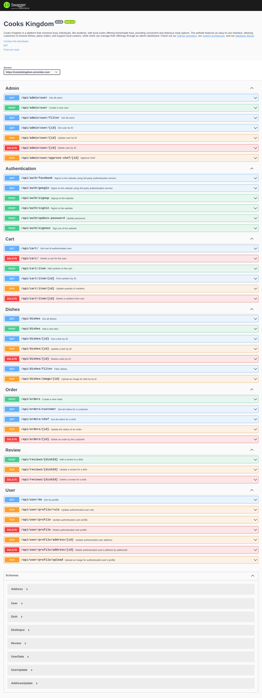

<br />
<div align="center">
  <h1 align="center">Cooks Kingdom</h1>

  <a href="https://cookskingdom.onrender.com/">
    
  </a>
  <p align="center">
    Cookiz is a platform that connects busy individuals, like students, with local cooks offering<br>
    homemade food, providing convenient and delicious meal options. The website features an<br>
    easy-to-use interface, allowing customers to browse dishes, place orders, and support local<br>
    cookers, while chefs can manage their offerings through an admin dashboard.<br>
    <a href="https://cookskingdom.onrender.com/docs/"><strong>Explore the docs »</strong> </a>
    <br />
    <br />
    <a href="https://i.imgur.com/TxkCyZC.jpeg">View Demo</a>
    ·
    <a href="https://github.com/HishamWattar/cooks-kingdom/issues">Report Bug</a>
    ·
    <a href="https://github.com/HishamWattar/cooks-kingdom/issues">Request Feature</a>
  </p>
</div>

### Table of Contents

1. [About the Project](#about-the-project)
    - [Project Features](#project-features)
    - [Tools and Technologies](#tools-and-technologies)
    - [Design Diagrams](#design-diagrams)
        - [System Architecture Diagram](#system-architecture-diagram)
        - [Database Schema Design](#database-schema-design)
2. [Installation Guide](#installation-guide)
    - [Prerequisites](#prerequisites)
    - [Installation](#installation)
3. [Frontend Application](#frontend-application)
4. [Contributing Guide](#contributing-guide)
5. [Contributors](#contributors)
6. [License](#license)
7. [Acknowledgments](#acknowledgments)
8. [Contact](#contact)

## About the Project

Cookiz is a dynamic and innovative platform designed to bridge the gap between individuals seeking homemade meals and local cooks who are passionate about sharing their culinary expertise. The project's ideology revolves around providing a convenient and delicious solution for people with limited time to cook, such as students and busy professionals, while also supporting local cookers and their culinary ventures.

The primary objective of Cookiz is to create a seamless and user-friendly experience for both customers and cooks. The platform enables customers to explore a diverse range of dishes, filter options based on location and preferences, and effortlessly place orders for homemade food. On the other hand, local cooks have access to an admin dashboard, allowing them to showcase their culinary creations, post images, and provide enticing descriptions to enthrall potential customers.

At its core, Cookiz aims to foster a thriving community of food enthusiasts, where customers can indulge in delectable homemade dishes and cooks can take pride in serving their creations to a wider audience. The project stands as a testament to the power of technology in connecting people, facilitating impactful collaborations, and nurturing a sense of culinary camaraderie among diverse communities.

Cookiz empowers individuals with limited time to relish the joys of homemade meals without the hassles of cooking. It cultivates an ecosystem where local cooks can showcase their talents and build a loyal customer base. By bringing together culinary passions and technological ingenuity, Cookiz envisions transforming how homemade food is experienced and enjoyed by people worldwide. Join Cookiz in savoring the delights of homemade goodness and embracing the spirit of community-driven gastronomy.

### Project Features

-   CRUD Orders/Dishes/Carts
-   Sign in/up/out
-   Create a cutsomer or a chef account
-   Edit cutsomer or a chef account
-   Review a dish
-   Get public dishes
-   Filter publish dishes
-   Sign in/up with Google
-   Sign in/up with Twitter

### Tools and Technologies

-   [![Figma-shield]][figma-link]
-   [![Github-shield]][github-link]
-   [![Git-shield]][git-link]
-   [![Prettier-shield]][prettier-link]
-   [![Eslint-shield]][eslint-link]
-   [![mongodb-shield]][mongodb-link]
-   [![nodejs-shield]][nodejs-link]
-   [![express-shield]][express-link]
-   [![express-validator-shield]][express-validator-link]
-   [![swagger-shield]][swagger-link]
-   [![Jest-shield]][jest-link]
-   [![JWT-shield]][jwt-link]
-   [![Passport-shield]][passport-link]
-   [![Postman-shield]][postman-link]
-   [![yarn-shield]][yarn-link]
-   [![nodemailer-shield]][nodemailer-link]
-   
-   
-   [![google-shield]][google-link]
-   [![twitter-shield]][twitter-link]
-   
-   [![husky-shield]][husky-link]

### Design Diagrams

#### System Architecture Diagram

In this diagram, you can see the various components of our REST API, such as API routers, services, and utils, as well as our MongoDB database and how it is integrated with the rest of the project.



#### Database Schema Design

This is known as a UML diagram, and it shows the collections used in the database, their properties, the relationships between them, and the functionality that each collection (class) can have. We chose this diagram because it contains a lot of information and will help us organize our thoughts as we implement our application.


## Installation Guide

### Prerequisites

1. [Node.js](https://nodejs.org/en/)
2. [Yarn](https://yarnpkg.com/)
3. [Git](https://git-scm.com/)

### Installation

1. Clone the repo
    ```sh
    git clone git@github.com:HishamWattar/cooks-kingdom.git
    ```
2. Navigate to the project folder

    ```sh
    cd cooks-kingdom
    ```

3. Install dependencies
    ```sh
    yarn install
    ```
4. Run the project
    ```sh
    yarn start
    ```
5. Run checks and tests
    ```sh
    yarn test
    ```

## Documentation

Explore our interactive documentation API [here](https://cookskingdom.onrender.com/docs/).



## Frontend Application

-   Check front-end application [here](https://github.com/ReCoded-Org/cookiz-capstone-project)

-   [](https://cookskingdom.onrender.com/)

## Contributing Guide

Contributions are what make the open source community such a wonderful place to learn, be motivated, and create. Your contributions are **deeply appreciated**.

1. Fork the Project
2. Create your Feature Branch (`git checkout -b feature/AmazingFeature`)
3. Commit your Changes (`git commit -m 'Add some AmazingFeature'`)
4. Push to the Branch (`git push origin feature/AmazingFeature`)
5. Open a Pull Request

## Contributors

|  |  |  |    |  |
| -------------------------------------------------------- | ------------------------------------------------------ | ---------------------------------------------------------- | ------------------------------------------------------ | ------------------------------------------------------ | 
| Junior Engineer                                        | Junior Engineer                                            | Junior Engineer                                        | Junior Engineer                                        | Junior Engineer                                        |
| [Hisham Al Wattar](https://github.com/HishamWattar/)             | [Rawan Mustafa](https://github.com/0Rawan)             | [Mahmoud Alshahin](https://github.com/mahmoudsha)              | [Ahmad Alashtar](https://github.com/ahmadalashtar) | [Sakarie Ali](https://github.com/sack-ali)       

## License

Distributed under the MIT License. See [LICENSE](https://choosealicense.com/licenses/mit/) for more information.

## Acknowledgments

-   [![google-shield]][google-link]
-   [![stackoverflow-shield]][stackoverflow-link]

## Contact

### Cooks Kingdom Team

**Email:** pebbleworkplatform@gmail.com

<!-- Links -->

[stackoverflow-shield]: https://img.shields.io/badge/stackoverflow-F8F9F9?style=flat&logo=stackoverflow
[stackoverflow-link]: https://stackoverflow.com/
[heroku-shield]: https://img.shields.io/badge/heroku-7D4E89?style=flat&logo=heroku
[heroku-link]: https://www.heroku.com
[yarn-shield]: https://img.shields.io/badge/yarn-FFFFFF?style=flat&logo=yarn
[yarn-link]: https://yarnpkg.com/
[nodemailer-shield]: https://img.shields.io/badge/nodemailer-22B573?style=flat&logo=nodemailer
[nodemailer-link]: https://nodemailer.com/
[google-shield]: https://img.shields.io/badge/google-FFFFFF?style=flat&logo=google
[google-link]: https://www.google.com/
[twitter-shield]: https://img.shields.io/badge/twitter-FFFFFF?style=flat&logo=twitter
[twitter-link]: https://www.twitter.com/
[firebase-shield]: https://img.shields.io/badge/firebase-FFFFFF?style=flat&logo=firebase
[firebase-link]: https://firebase.google.com/
[husky-shield]: https://img.shields.io/badge/husky-FFFFFF?style=flat&logo=husky
[husky-link]: https://www.npmjs.com/package/husky
[postman-shield]: https://img.shields.io/badge/postman-FFFFFF?style=flat&logo=postman
[postman-link]: https://www.postman.com/
[passport-shield]: https://img.shields.io/badge/passport-FFFFFF?style=flat&logo=passport
[passport-link]: https://www.passportjs.org/
[react-shield]: https://img.shields.io/badge/react-61DAFB?style=flat&logo=react&logoColor=white
[react-link]: https://reactjs.org/
[html-shield]: https://img.shields.io/badge/html-E34F26?style=flat&logo=html5&logoColor=white
[html-link]: https://en.wikipedia.org/wiki/HTML
[css-shield]: https://img.shields.io/badge/CSS3-1572B6?style=flat&logo=css3&logoColor=white
[css-link]: https://en.wikipedia.org/wiki/CSS
[figma-shield]: https://img.shields.io/badge/Figma-F24E1E?style=flat&logo=figma&logoColor=white
[figma-link]: https://www.figma.com/
[github-shield]: https://img.shields.io/badge/github-181717?style=flat&logo=github&logoColor=white
[github-link]: https://github.com/
[git-shield]: https://img.shields.io/badge/Git-F05032?style=flat&logo=git&logoColor=white
[git-link]: https://git-scm.com/
[prettier-shield]: https://img.shields.io/badge/Prettier-F7B93E?style=flat&logo=Prettier&logoColor=white
[prettier-link]: https://prettier.io/
[eslint-shield]: https://img.shields.io/badge/eslint-4B32C3?style=flat&logo=eslint&logoColor=white
[eslint-link]: https://eslint.org/
[mongodb-shield]: https://img.shields.io/badge/mongodb-47A248?style=flat&logo=mongodb&logoColor=white
[mongodb-link]: https://www.mongodb.com/atlas/database
[nodejs-shield]: https://img.shields.io/badge/node_js-339933?style=flat&logo=node.js&logoColor=white
[nodejs-link]: https://nodejs.dev/learn/get-http-request-body-data-using-nodejs
[express-shield]: https://img.shields.io/badge/express-000000?style=flat&logo=express&logoColor=white
[express-link]: https://expressjs.com/
[express-validator-shield]: https://img.shields.io/badge/express_validator-7457c2?style=flat
[express-validator-link]: https://express-validator.github.io/docs/
[jwt-shield]: https://img.shields.io/badge/jwt-000000?style=flat&logo=json-web-tokens&logoColor=white
[jwt-link]: https://jwt.io/
[swagger-shield]: https://img.shields.io/badge/swagger-85EA2D?style=flat&logo=swagger&logoColor=white
[swagger-link]: https://swagger.io/
[jest-shield]: https://img.shields.io/badge/jest-C21325?style=flat&logo=jest&logoColor=white
[jest-link]: https://jestjs.io/
[cron-shield]: https://img.shields.io/badge/node_cron-185717?style=flat
[cron-link]: https://en.wikipedia.org/wiki/Cron
[aws-shield]: https://img.shields.io/badge/Amazon_AWS-232F3E?style=flate&logo=Amazon-AWS&logoColor=white
[aws-link]: https://en.wikipedia.org/wiki/Amazon_Web_Services
[uuid-link]: https://img.shields.io/badge/UUID-azure?style=flat&logo=uuid&logoColor=white
[multer-link]: https://jestjs.io/